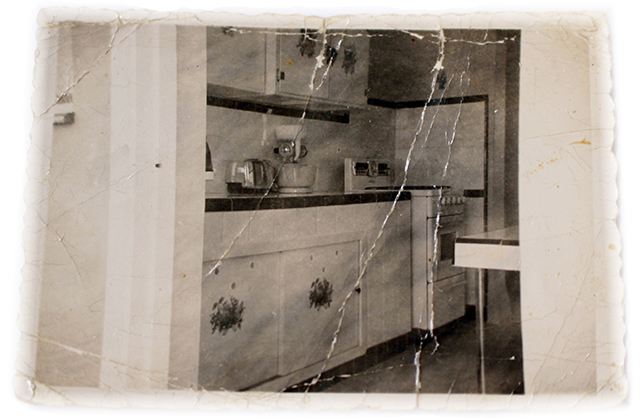
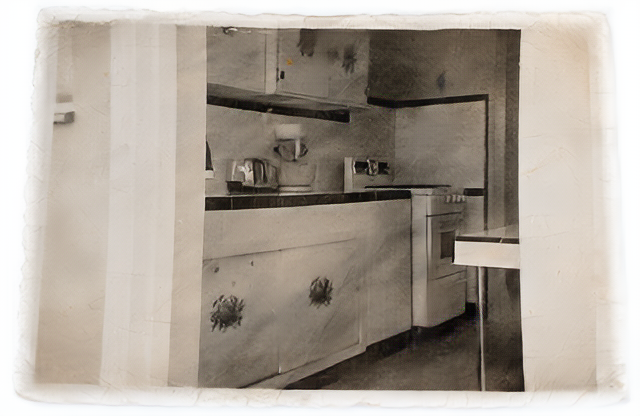

<h1 align="center">
	Abuela
</h1>

	This photo restoration app enables anyone to upload a old photo and have it automatically restored using AI.

 

  

<h2 align="center">
	Photo Restoration
</h2>

| Before | After |
| :---:  | :---: | 
|  |  |
|  |  |

## Who is this meant for?
If the title didn't give it away, this app is meant for my grandmother to enjoy.

In the early '60s, my grandparents immigrated from Cuba to the U.S. to escape Castro and his army. With nothing but the clothes on their backs, two kids (and one on the way, 👋 Hi Mom!) left the shores of Miami, moved to D.C., and started over. Being the amazing person she is, Emma ended up running data centers in the '70s making her [OG](https://www.dictionary.com/e/slang/og/) I.T.

She's always been a massive inspiration to me (both my grandparents have). And so, I wanted to build her this app in hopes that she could breathe some new life into old photos using tech she helped pave the way to make.

## Architecture
At a high-level, this is a [Streamlit](streamlit.io) app front-end running on top a k8's cluster running a ML pipeline https://github.com/microsoft/Bringing-Old-Photos-Back-to-Life via [Pachyderm](https://pachyderm.com). Detailed Blog in progress.

### TODO
- [ ] Find better hardware (Cuda OOM errors with a Titan V & 3070 on localhost).  
- [ ] Add colorization option. 
- [ ] Build affordable GCP option for blog. 
