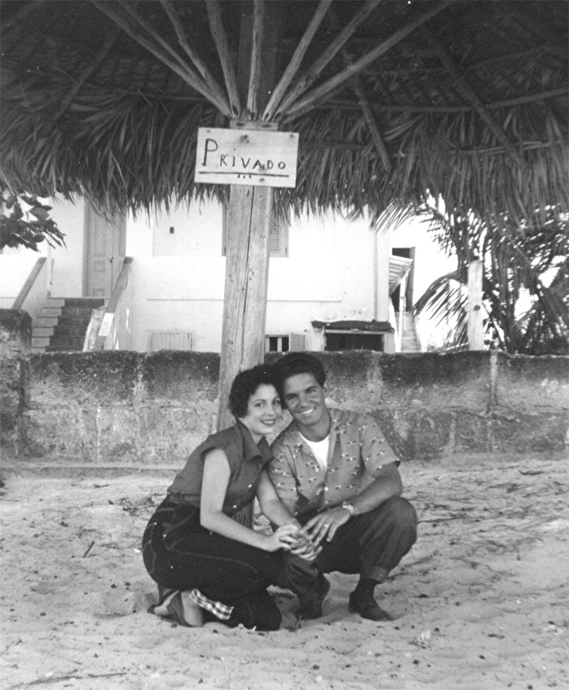
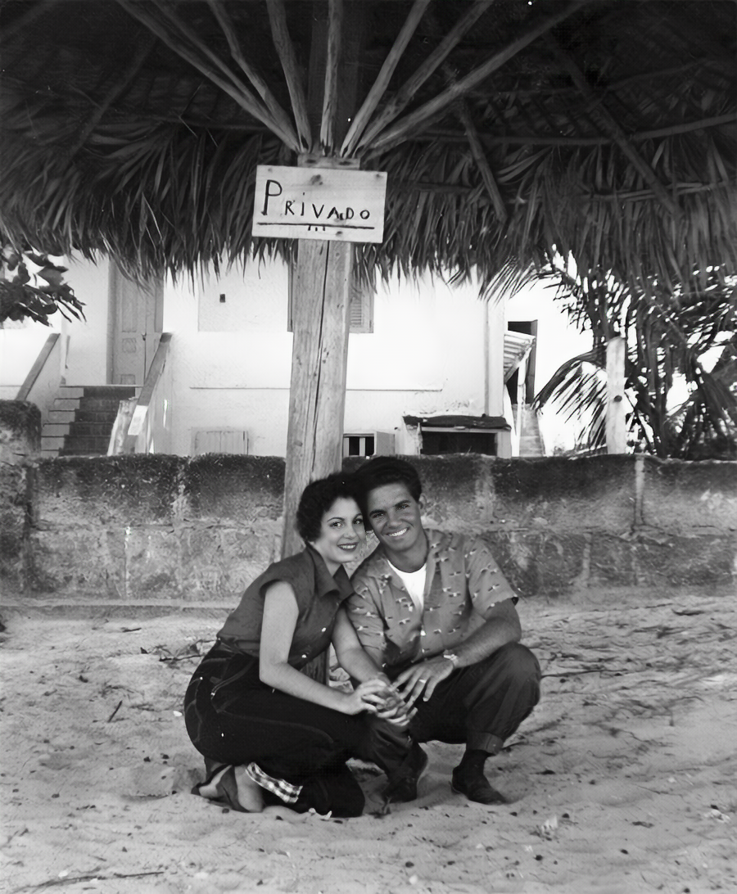

<h1 align="center">
	Abuela
</h1>

	This photo restoration app enables anyone to upload a old photo and have it automatically restored using AI.

 

  

<h2 align="center">
	Photo Restoration
</h2>

| Before | After |
| :---:  | :---: | 
|  |  

## Who is this meant for?
If the title didn't give it away, this app is meant for my grandmother to enjoy.  

In the early 60's my grandparents immigrated from Cuba to the US in order to escape Castro and his army. With nothing but the clothes on their backs, two kids (and one on the way, :wave: Hi Mom!) they left the shores of miami moved to DC and started over. Emma, being the amazing person she is, ended up running data centers in the 70's making here [OG](https://www.dictionary.com/e/slang/og/) I.T.

She's always been a huge inspiration to me (both my grandparents have). And so, I wanted to build her this app in hopes that she could breath some new life into old photos using tech she helped pave the way to build.

## Architecture
At a high-level, this is a [Streamlit](streamlit.io) app front-end running on top a k8's cluster running a ML pipeline https://github.com/microsoft/Bringing-Old-Photos-Back-to-Life via [Pachyderm](https://pachyderm.com). Detailed Blog in progress. 
